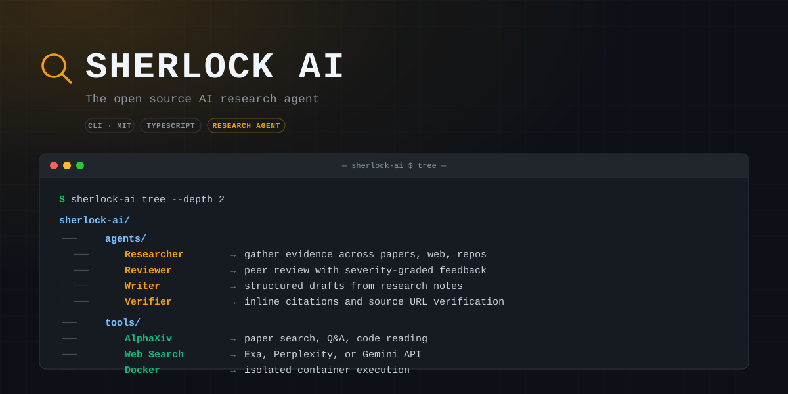

<p align="center">
  
</p>
<p align="center">
  <a href="https://sherlock-ai.dev/docs"></a>
  <a href="https://github.com/sauravg666/sherlock-ai/blob/main/LICENSE"></a>
</p>

---

### Installation

**macOS / Linux:**

```bash
curl -fsSL https://sherlock-ai.dev/install | bash
```

**Windows (PowerShell):**

```powershell
irm https://sherlock-ai.dev/install.ps1 | iex
```

The one-line installer fetches the latest tagged release. To pin a version, pass it explicitly, for example `curl -fsSL https://sherlock-ai.dev/install | bash -s -- 0.2.35`.

The installer downloads a standalone native bundle with its own Node.js runtime.

To upgrade the standalone app later, rerun the installer. `sherlock-ai update` only refreshes installed Pi packages inside Sherlock's environment; it does not replace the standalone runtime bundle itself.

To uninstall the standalone app, remove the launcher and runtime bundle, then optionally remove `~/.sherlock-ai` if you also want to delete settings, sessions, and installed package state. If you also want to delete alphaXiv login state, remove `~/.ahub`. See the installation guide for platform-specific paths.

Local models are supported through the setup flow. For LM Studio, run `sherlock-ai setup`, choose `LM Studio`, and keep the default `http://localhost:1234/v1` unless you changed the server port. For LiteLLM, choose `LiteLLM Proxy` and keep the default `http://localhost:4000/v1`. For Ollama or vLLM, choose `Custom provider (baseUrl + API key)`, use `openai-completions`, and point it at the local `/v1` endpoint.

### Skills Only

If you want just the research skills without the full terminal app:

**macOS / Linux:**

```bash
curl -fsSL https://sherlock-ai.dev/install-skills | bash
```

**Windows (PowerShell):**

```powershell
irm https://sherlock-ai.dev/install-skills.ps1 | iex
```

That installs the skill library into `~/.codex/skills/sherlock-ai`.

For a repo-local install instead:

**macOS / Linux:**

```bash
curl -fsSL https://sherlock-ai.dev/install-skills | bash -s -- --repo
```

**Windows (PowerShell):**

```powershell
& ([scriptblock]::Create((irm https://sherlock-ai.dev/install-skills.ps1))) -Scope Repo
```

That installs into `.agents/skills/sherlock-ai` under the current repository.

For an OpenCode project-local install instead:

**macOS / Linux:**

```bash
curl -fsSL https://sherlock-ai.dev/install-skills | bash -s -- --opencode
```

**Windows (PowerShell):**

```powershell
& ([scriptblock]::Create((irm https://sherlock-ai.dev/install-skills.ps1))) -Scope OpenCode
```

That installs into `.opencode/skills/sherlock-ai` under the current repository.

These installers download the bundled `skills/` and `prompts/` trees plus the repo guidance files referenced by those skills. They do not install the Sherlock terminal, bundled Node runtime, auth storage, or Pi packages.

---

### What you type → what happens

```
$ sherlock-ai "what do we know about scaling laws"
→ Searches papers and web, produces a cited research brief

$ sherlock-ai deepresearch "mechanistic interpretability"
→ Multi-agent investigation with parallel researchers, synthesis, verification

$ sherlock-ai lit "RLHF alternatives"
→ Literature review with consensus, disagreements, open questions

$ sherlock-ai audit 2401.12345
→ Compares paper claims against the public codebase

$ sherlock-ai replicate "chain-of-thought improves math"
→ Replicates experiments on local or cloud GPUs
```

---

### Workflows

Ask naturally or use slash commands as shortcuts.

| Command | What it does |
| --- | --- |
| `/deepresearch <topic>` | Source-heavy multi-agent investigation |
| `/lit <topic>` | Literature review from paper search and primary sources |
| `/review <artifact>` | Simulated peer review with severity and revision plan |
| `/audit <item>` | Paper vs. codebase mismatch audit |
| `/replicate <paper>` | Replicate experiments on local or cloud GPUs |
| `/compare <topic>` | Source comparison matrix |
| `/draft <topic>` | Paper-style draft from research findings |
| `/autoresearch <idea>` | Autonomous experiment loop |
| `/watch <topic>` | Recurring research watch |
| `/outputs` | Browse all research artifacts |

---

### Agents

Four bundled research agents, dispatched automatically.

- **Researcher** — gather evidence across papers, web, repos, docs
- **Reviewer** — simulated peer review with severity-graded feedback
- **Writer** — structured drafts from research notes
- **Verifier** — inline citations, source URL verification, dead link cleanup

---

### Skills & Tools

- **[AlphaXiv](https://www.alphaxiv.org/)** — paper search, Q&A, code reading, annotations (via `alpha` CLI)
- **Docker** — isolated container execution for safe experiments on your machine
- **Web search** — Exa, Perplexity, or Gemini API; no Chromium cookie access by default
- **Session search** — indexed recall across prior research sessions
- **Preview** — browser and PDF export of generated artifacts
- **Modal** — serverless GPU compute for burst training and inference
- **RunPod** — persistent GPU pods with SSH access for long-running experiments

---

### How it works

Built on [Pi](https://github.com/badlogic/pi-mono) for the agent runtime, [alphaXiv](https://www.alphaxiv.org/) for paper search and analysis, and CLI tools for compute and execution. Capabilities are delivered as [Pi skills](https://github.com/badlogic/pi-skills) — Markdown instruction files synced to `~/.sherlock-ai/agent/skills/` on startup. Every output is source-grounded — claims link to papers, docs, or repos with direct URLs.

---

### Contributing

See [CONTRIBUTING.md](CONTRIBUTING.md) for the full contributor guide.

```bash
git clone https://github.com/sauravg666/sherlock-ai.git
cd sherlock-ai
nvm use || nvm install
npm install
npm test
npm run typecheck
npm run build
```

[Docs](https://sherlock-ai.dev/docs) · [Release Notes](RELEASES.md) · [MIT License](LICENSE)
